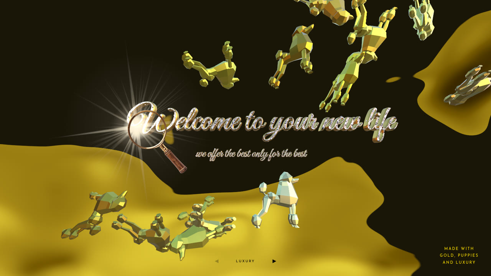
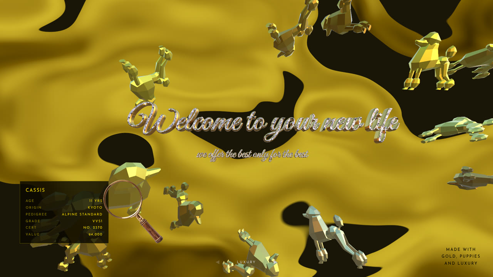
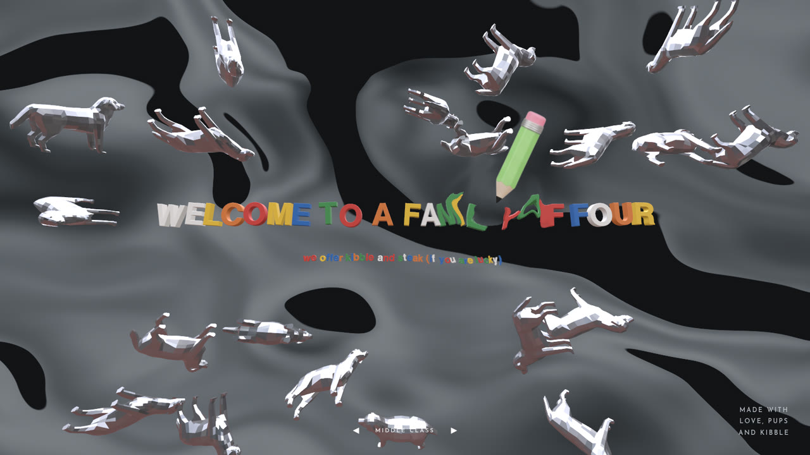
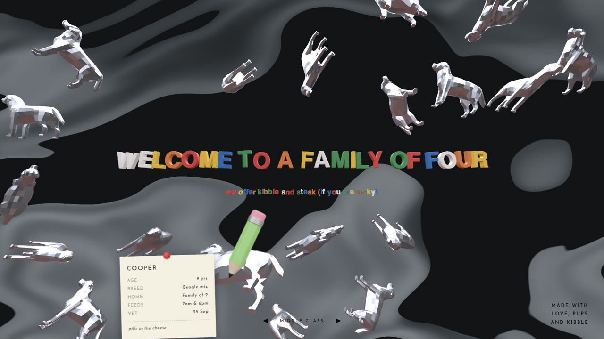
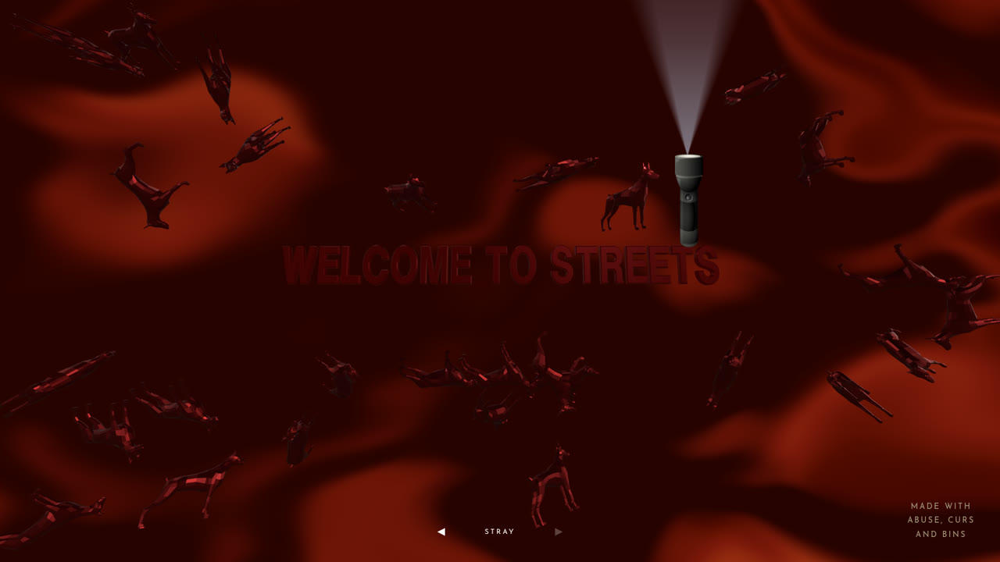
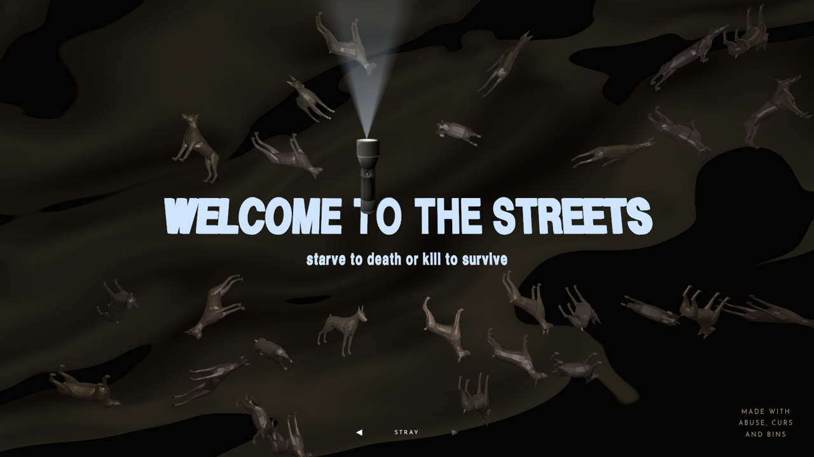
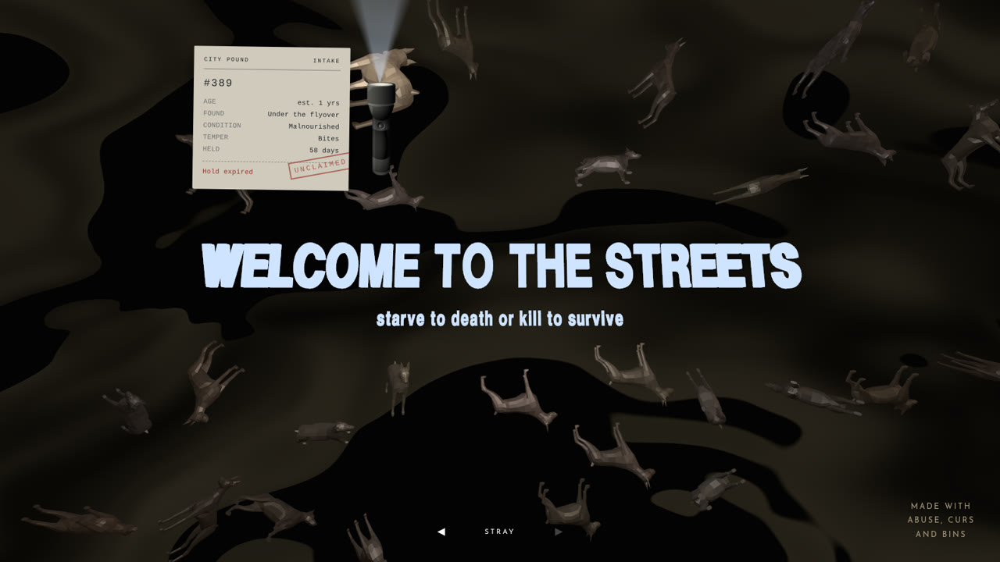

# dogs-gold

Three worlds of dogs, navigated by the arrows at the bottom of the screen:
**luxury**, **middle class**, **stray**. Each is a react-three-fiber scene with
its own background, palette, instrument, and revealed document.

**Live:** https://bigk-out.github.io/dogs-gold/

Desktop only — the interaction is pointer-driven and the page hides the cursor.



## Features

### Three worlds, one descent

The arrows (or ← / →) move down a class ladder, one world at a time. Each
switch fades through black, and the curtain only lifts once the next world's
models have loaded, so you never see an empty scene. Each world has its own
dogs, background, header, pointer instrument and dog card.

### Luxury — the showroom

- Gold poodles drift over a shader-animated river of gold.
- The headline is extruded script lettering set with real cut stones, each one
  turning on its own axis. A lamp travels with the loupe, so the stones flash
  as the glass passes, and a sunburst flare blooms wherever it crosses a letter.
- Hold the **jeweller's loupe** over a dog and it lifts toward you; keep it there
  and a **certificate of value** appears: name, age, origin, pedigree, grade,
  certificate number and price.



### Middle class — the fridge door

- Silver dogs over cold slate water.
- The header is spelled out in **fridge magnets**: each letter its own mesh and
  colour, set down slightly crooked. Run the pointer through them and they get
  knocked aside, then spring back and rock into place.
- The instrument is a **pencil**, and a locked dog gets a **note pinned to the
  fridge**: feeding times, when the vet is due, whose turn it is to walk it.

| Knocking the magnets | The fridge note |
| --- | --- |
|  |  |

### Stray — the streets

- You arrive in red: the water runs like blood, the dogs turn red, and the
  lights cut out a few times before the scene settles into dark, dirty water.
- The lettering then lights up like a failing strip light. Individual letters
  flicker on their own schedule, and it's the only real light in the world, so
  the dogs nearest the sign are the ones you can see.
- The instrument is a **flashlight** with a working beam: a spotlight in the
  scene lights the dogs it passes over.
- A locked dog gets a **pound intake slip**: tag number, where it was found,
  its condition and temper, days held, and an UNCLAIMED stamp once its hold has
  run out.

| Arrival | The streets | The intake slip |
| --- | --- | --- |
|  |  |  |

### Throughout

- A rippling brush-stroke distortion trails the pointer in every world.
- Fast pointer movement scatters the pack; a slow pointer near a dog leaves it
  alone, so you can inspect it.
- Every dog's card is generated from its index, so the same dog always shows
  the same details.
- The arrow label switches between black and white based on the pixels behind
  it, so it stays readable over any background.

## Stack

| | |
| --- | --- |
| UI | [React 18](https://react.dev) |
| 3D | [three.js](https://threejs.org) r168 via [react-three-fiber](https://r3f.docs.pmnd.rs) 8 |
| 3D helpers | [drei](https://github.com/pmndrs/drei) — `Text3D`, `Environment`, `useGLTF`, `Center`, `Resize` |
| Post-processing | [@react-three/postprocessing](https://github.com/pmndrs/react-postprocessing) — depth of field, bloom, and a custom warp effect |
| Shaders | Hand-written GLSL: the river backgrounds, the pointer warp, per-letter flicker |
| Models | glTF (`.glb`), one per world |
| Build | [Vite](https://vite.dev) 5 with the SWC React plugin |
| Tests | Node's built-in `node:test` — no test framework dependency |
| Lint | ESLint 9 (flat config) |
| Deploy | GitHub Actions → GitHub Pages |

## Run

```bash
npm install
npm run dev      # http://localhost:5173
npm test         # node --test, recursive
npm run lint
npm run build
```

## How a world works

`src/worlds/registry.js` holds an ordered array. Array order is arrow order.
The shell in `src/App.jsx` never branches on which world is active — it reads
only the keys below.

| Key | Required | Meaning |
| --- | --- | --- |
| `id`, `label` | yes | identity, and the text between the arrows |
| `pageBackground` | yes | painted behind the canvas; visible mid-transition |
| `camera` | yes | `{ fov, near, far }`, applied on mount |
| `Scene` | yes | the in-canvas subtree |
| `instrument` | yes | `{ src, size, cx, cy, radius }` — art plus measured ratios |
| `selection` | yes | `{ radius, releaseMargin, dwellMs }` |
| `Card`, `cardStyle` | no | the reveal panel's content and container style |
| `depthOfField` | no | blur settings for the shared ripple pass; omit for none |
| `Instrument` | no | replaces the shared pointer-following positioner |
| `Overlay` | no | extra DOM inside the shell wrapper |

`src/shared/` holds what every world reuses: the pointer singleton, the physics
loop, the dog mesh, the selection state machine, the instrument positioner, the
card container, and the ripple pass. `src/shell/` holds the navigation reducer
and the transition.

## The ripple pass is mounted once

`shared/RippleWarp.jsx` is rendered by the shell, outside the keyed world
subtree, and is never unmounted. This is load-bearing:
`@react-three/postprocessing` builds its `EffectComposer` in a `useMemo` and
never calls `composer.dispose()`, so every unmount abandons that composer's
render targets. One composer per world leaked framebuffers, renderbuffers and
textures on every switch.

**Do not move it into a world's `Scene`.** A world varies the effect through
config — `depthOfField` today — rather than by mounting its own composer.

## Adding a world

1. Create `src/worlds/<id>/` with an `index.js` exporting the config above.
2. Add it to the array in `src/worlds/registry.js`.

No shell code changes.

## Instrument ratios

`cx`, `cy`, and `radius` are fractions of the image width, measured from the
art's alpha channel: where the instrument's *active point* sits within the
image. The luxury loupe's handle occupies the lower right, so its glass is up
and to the left of centre — centring the PNG on the pointer would put the handle
under the cursor. Re-measure these whenever the art is replaced.

## Credits

- `src/shared/textures/diamond.png` — diamond photograph from Vecteezy,
  downscaled from the original to 512px.
- `src/worlds/stray/flashlight.png` — flashlight image from Pngtree,
  downscaled from the original.
- `src/worlds/middle/pencil.png` — pencil image from Vecteezy, cropped to the
  drawn pixels and downscaled from 6250px to 400px.
- `src/shared/fonts/great-vibes.typeface.json` — Great Vibes by Robert Leuschke
  (TypeSETit), SIL Open Font License, converted from the Google Fonts TTF.

## Deploying

Built by `.github/workflows/deploy.yml` and served from `/dogs-gold/` on
GitHub Pages, so `vite.config.js` sets `base` to match. **Every `public/` asset
must route through `import.meta.env.BASE_URL`** — a root-absolute path 404s
under the prefix and yields a scene with no dogs and no visible error.
